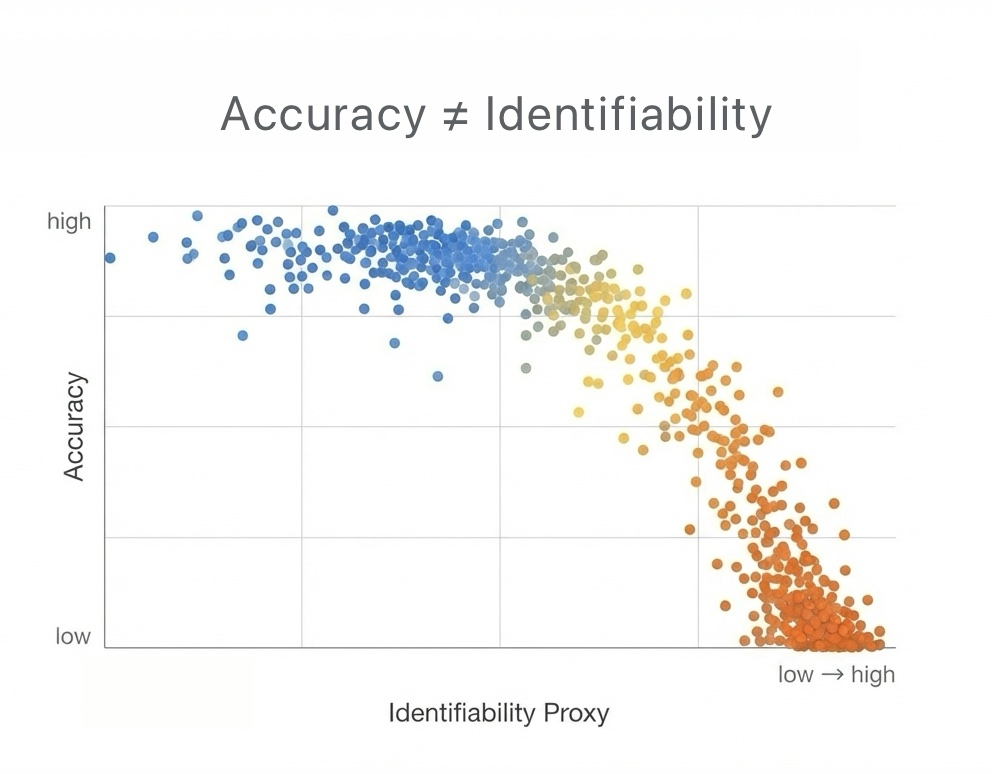

# Quantum Machine Learning Verification Laboratory (QVL)

*A reproducible verification harness for Quantum Machine Learning systems that stress-tests the central failure mode: **high accuracy can coexist with low identifiability**.*

<br>

[](https://www.python.org/downloads/)
[](https://opensource.org/licenses/MIT)
[](https://scholar.google.com/citations?user=tvwpCcgAAAAJ)
[](https://huggingface.co/Cohaerence)
[](https://x.com/coherence)
[](https://www.christopheraltman.com)
[](https://www.linkedin.com/in/Altman)

<br>

<div align="center">
  <picture>
    <source media="(prefers-color-scheme: dark)" srcset="figures/hero_dark.jpg">
    <source media="(prefers-color-scheme: light)" srcset="figures/hero_light.jpg">
    
  </picture>
</div>

<br>

---

## Table of Contents

1. [The Problem](#the-problem)
2. [The Phenomenon](#the-phenomenon)
3. [Theoretical Basis](#theoretical-basis)
4. [Quickstart](#quickstart)
5. [Architecture](#architecture)
6. [Configuration](#configuration)
7. [Verification Metrics](#verification-metrics)
8. [Artifact Contract](#artifact-contract)
9. [Reporting](#reporting)
10. [Reproduction](#reproduction)
11. [Validation & Testing](#validation--testing)
12. [Troubleshooting](#troubleshooting)
13. [Related Work](#related-work)
14. [Roadmap](#roadmap)
15. [References](#references)
16. [Citations](#citations)
17. [License](#license)
18. [Contact](#contact)

---

## The Problem

High test accuracy in quantum machine learning models can arise from multiple mechanisms:

1. **True learning**: The model has discovered generalizable patterns.
2. **Noise exploitation**: The model exploits specific noise signatures rather than signal.
3. **Identifiability collapse**: Parameters are not uniquely determined by data.

Standard ML evaluation cannot distinguish between these cases. A model can achieve high accuracy while being fundamentally non-identifiable—making it scientifically invalid and practically unreliable.

QVL is an **instrument**, not a model zoo. It outputs traceable, reproducible evidence rather than optimistic metrics.

---

## The Phenomenon

In noisy quantum systems, we observe a troubling pattern:

- Models maintain high accuracy under noise
- The parameter-to-output mapping becomes many-to-one
- Fisher information geometry collapses
- Robustness to seed/initialization vanishes
- The model appears to "work" but is not actually learning

This is the **Verification Gap**: the space where a model appears to work but is not actually learning. QVL makes this gap quantifiable and reproducible.

**Concrete example (toy backend):**

| Noise Level | Accuracy | Identifiability Proxy |
|-------------|----------|----------------------|
| `depolarizing_p=0.0, bitflip_p=0.0` | ~0.95 | ~0.80 |
| `depolarizing_p=0.2, bitflip_p=0.2` | ~0.70 | ~0.05 |

Noise degrades identifiability faster than accuracy. The second model is scientifically invalid despite acceptable test performance.

---

## Theoretical Basis

QVL moves beyond loss curves to measure **Epistemic Quality** using information geometry.

### Fisher Information & Identifiability

The Fisher Information Matrix (FIM) quantifies how much observable data constrains parameters:

$$
I(\theta)_{ij} = \mathbb{E}_{x \sim \mathcal{D}} \left[ \frac{\partial \log p(x\mid\theta)}{\partial \theta_i} \frac{\partial \log p(x\mid\theta)}{\partial \theta_j} \right]
$$

When $I(\theta)$ is rank-deficient or ill-conditioned, the model is **non-identifiable**—changes in parameters along certain directions do not affect the output.

### Effective Dimension

To measure active model capacity under noise:

$$
d_{\mathrm{eff}} = \frac{N \sum_k \lambda_k}{\sum_k \lambda_k + \delta}
$$

Where $\lambda_k$ are FIM eigenvalues, $N$ is data count, and $\delta$ is a regularization term. A collapse in $d_{\mathrm{eff}}$ indicates noise has washed out expressivity, even if accuracy remains high.

### Curvature Intuition

For loss $\mathcal{L}(\theta)$, a flat valley means many $\theta$ yield similar behavior. Hessian eigenvalues and condition numbers distinguish sharp versus flat constraints. QVL's proxies are designed for reliable finite-data signals, not asymptotic purity.

---

## Quickstart

**Installation (basic):**

```bash
git clone https://github.com/christopher-altman/qml-verification-lab.git
cd qml-verification-lab
python -m venv .venv
source .venv/bin/activate
pip install -e ".[dev]"
```

**With PennyLane backend:**

```bash
pip install -e ".[dev,pennylane]"
```

**Run the canonical battery (112 runs, ~2 min):**

```bash
python -m qvl battery
```

**Outputs:**
- `figures/hero_dark.png`, `figures/hero_light.png` — Hero plots
- `results/summary.csv` — Tabular results

**Run tests:**

```bash
pytest -q
```

---

## Architecture

QVL separates concerns cleanly:

```text
qvl/
├── cli.py              # Argument parsing and command dispatch
├── config.py           # YAML loading and validation
├── runner.py           # Single run + sweep orchestration
├── artifacts.py        # Standardized output contract
├── plotting.py         # Hero figures (dark/light variants)
├── batteries/          # Verification metric implementations
│   └── registry.py     # Composable metric registry
└── backends/           # Pluggable experiment backends
    ├── deterministic/  # NumPy-only, bit-perfect reproduction
    ├── toy/            # Synthetic logistic regression
    └── pennylane/      # 2-qubit VQC (optional)
```

**Design rationale:**
- **Backends** define "what experiment is"
- **Batteries** define "how it is verified"
- **Runner + Artifacts** define "how it is made reproducible"

### Backend Plugin System

Backends implement a strict interface:

```python
class Backend:
    def __init__(self, config: dict): ...
    def run(self) -> dict: ...  # Returns metrics, noise, timing
```

**Available backends:**

| Backend | Description | Dependencies |
|---------|-------------|--------------|
| `deterministic` | NumPy-only, bit-perfect CI baseline | Always available |
| `toy` | Logistic regression with controllable noise | Always available |
| `pennylane` | 2-qubit VQC with quantum noise channels | `pip install -e ".[pennylane]"` |

See [BACKENDS.md](BACKENDS.md) for the complete guide to adding custom backends.

---

## Configuration

Experiments are configured via YAML. QVL resolves configs into fully materialized JSON for auditability.

**Example configuration:**

```yaml
experiment_id: my_verification_run
backend: toy
task: classification

training:
  n_samples: 200
  n_features: 2
  n_epochs: 150
  learning_rate: 0.1

noise:
  depolarizing_p: 0.1
  measurement_bitflip_p: 0.05
  amplitude_gamma: 0.01

# For sweeps
sweep:
  depolarizing_p: [0.0, 0.05, 0.1, 0.15, 0.2]
  measurement_bitflip_p: [0.0, 0.05, 0.1, 0.15, 0.2]
```

**Key parameters:**

| Key | Type | Description |
|-----|------|-------------|
| `experiment_id` | string | Unique identifier for artifact directories |
| `backend` | string | One of `deterministic`, `toy`, `pennylane` |
| `noise.depolarizing_p` | float | Feature noise intensity (simulates decoherence) |
| `noise.measurement_bitflip_p` | float | Label noise (simulates measurement errors) |
| `noise.amplitude_gamma` | float | Regularization strength (simulates amplitude damping) |
| `sweep.*` | list | Grid values for parameter sweeps |

---

## Verification Metrics

QVL implements a metric registry making identifiability and curvature diagnostics first-class citizens.

| Metric | Purpose | Warning Threshold |
|--------|---------|-------------------|
| `accuracy` | Standard performance | N/A |
| `ident_proxy` | Identifiability signal strength [0,1] | `< 0.1` with `accuracy > 0.7` |
| `fisher_condition_number` | Parameter determinability | `> 1000` |
| `fisher_effective_rank` | Active parameter dimensions | `< 0.5 × theoretical` |
| `hessian_trace` | Sum of Hessian eigenvalues | N/A |
| `hessian_min_abs` / `hessian_max_abs` | Loss landscape geometry | Ratio `> 1000` |
| `curvature_proxy` | Local loss landscape geometry | N/A |
| `gradient_variance` | Gradient stability | N/A |
| `seed_robustness` | Stability across initialization | Variance `> 0.1` |

**Verification warning:** Triggered when `accuracy ≥ 0.7` but `ident_proxy ≤ 0.1`. This flags "potential overfitting or noise dominance."

---

## Artifact Contract

Every run produces a deterministic directory structure:

```text
artifacts/<experiment_id>/run_seed{seed:04d}_{hash}/
├── config.resolved.json          # Full frozen configuration
├── summary.json                  # Standardized metrics (Schema: v1)
├── results.jsonl                 # Per-point results (for sweeps)
├── env.json                      # Environment snapshot
├── git.json                      # Git metadata (optional)
├── tables/
│   └── leaderboard.csv
└── figures/
    ├── hero_identifiability_dark.png
    ├── hero_identifiability_light.png
    ├── hero_identifiability_dark_transparent.png
    └── hero_identifiability_light_transparent.png
```

The `summary.json` schema is **guaranteed stable** for downstream automation.

**Artifact policy:**

| Directory | Tracked | Purpose |
|-----------|---------|---------|
| `artifacts_demo/` | Yes | Small curated snapshot for quick review |
| `artifacts/` | No (gitignored) | Full experiment outputs |
| CI artifacts | No (uploaded) | Available as downloadable artifacts (7-day retention) |

---

## Reporting

Generate comprehensive reports after running sweeps:

```bash
python -m qvl report --input artifacts/my_experiment_id/ --output reports/my_report/
```

**Report outputs:**

- `summary.md` — Markdown summary with embedded plots
- `leaderboard.csv` — Tabular results with stable columns
- `figures/accuracy_vs_identifiability.png` — Scatter plot colored by Fisher condition number
- `figures/fisher_vs_accuracy.png` — Fisher diagnostics
- `figures/identifiability_heatmap.png` — Noise grid heatmap
- `hero_dark.png` / `hero_light.png` — Auto-selected storytelling point

**Hero selection heuristic:** The report automatically selects a hero point by scoring each result:
- Rewards high accuracy
- Penalizes low identifiability and high Fisher condition number
- Bonus for "tension points": `accuracy > 0.7` but `ident_proxy < 0.3`

This identifies the most compelling demonstration of the verification gap.

---

## Reproduction

Reproducibility is a first-class constraint.

**Seed control:** All experiments accept `--seed`:

```bash
python -m qvl run --config examples/toy_smoke.yaml --seed 42
```

**Config hashing:** Run directories include a short hash of the resolved configuration (e.g., `run_seed0042_2ad599bf`), enabling quick identification of parameter changes.

**Deterministic baseline:** The `deterministic` backend produces bit-for-bit identical results across platforms.

**Regenerate demo artifacts:**

```bash
bash scripts/generate_demo_artifacts.sh
```

---

## Validation & Testing

**Run the full test suite:**

```bash
pytest -q
```

**Run with coverage:**

```bash
pytest --cov=qvl --cov-report=term-missing
```

**What tests cover:**
- Backend interface compliance (all backends must pass contract tests)
- Metric registry correctness (output shapes, value ranges)
- Artifact contract validation (required files, schema compliance)
- CLI smoke tests (battery, run, sweep, report commands)
- Deterministic reproducibility (seed → identical output)

**Expected CI behavior:**
- All tests pass on Python 3.10+
- Deterministic backend produces identical artifacts across runs
- Test artifacts uploaded (30-day retention for deterministic, 7-day for others)

---

## Troubleshooting

### `ModuleNotFoundError: No module named 'pennylane'`

The PennyLane backend is optional. Install with:

```bash
pip install -e ".[pennylane]"
```

### Verification warning triggered but model seems fine

The warning (`accuracy ≥ 0.7, ident_proxy ≤ 0.1`) indicates the model achieves good predictions but parameters are not uniquely determined. This is the core phenomenon QVL detects—the model may be exploiting noise rather than learning. Inspect `fisher_condition_number` and `fisher_effective_rank` for additional diagnostics.

### Sweep runs out of memory

Reduce grid size in your YAML config or run fewer seeds:

```bash
python -m qvl sweep --config examples/toy_sweep_small.yaml --seeds 0
```

### Artifacts directory missing expected files

Ensure the run completed successfully. Check `config.resolved.json` for the actual parameters used. If `summary.json` is missing, the run likely failed—check stderr for exceptions.

### Hero plot not generated

The hero plot requires at least one completed run with both accuracy and identifiability metrics. Verify your backend implements the full metric interface.

### Different results across machines

Use the `deterministic` backend for cross-machine reproducibility. The `toy` and `pennylane` backends may have minor floating-point variations across platforms.

---

## Related Work

This laboratory extends and generalizes prior experimental work:

**[noise-aware-qnn-identifiability](https://github.com/christopher-altman/noise-aware-qnn-identifiability)** (2024)
- Demonstrated that quantum neural networks under noise exhibit high accuracy while losing parameter identifiability
- Used Fisher Information Matrix rank deficiency as the primary diagnostic
- Implemented proof-of-concept with PennyLane on fixed circuit architectures
- Established the verification gap: accuracy does not imply learning in noisy quantum systems

QVL generalizes this finding by:
- Abstracting the backend (toy, PennyLane, future: Qiskit, Cirq)
- Formalizing identifiability and curvature as first-class metrics via the metric registry
- Adding systematic noise sweeps, reproducible artifact contracts, and automated reporting
- Expanding verification diagnostics beyond Fisher rank to include Hessian geometry, robustness batteries, and warning thresholds

---

## Roadmap

**Current (Phase 3.0):** PennyLane backend with quantum noise channels.

**Phase 4.0:** Extended robustness batteries
- Cross-seed aggregation statistics
- Noise perturbation response analysis
- Initialization dependence mapping

**Phase 5.0:** Interactive reports
- Web dashboard for sweep exploration
- Publication-ready figure templates
- Exportable LaTeX tables

**Backend expansion:**
- Qiskit integration (IBM quantum simulators)
- Cirq integration (Google quantum frameworks)

**Metric extensions:**
- Barren plateau detection
- Entanglement spectrum analysis
- Expressibility metrics

**Verification protocols:**
- Automated decision rules for model acceptance/rejection
- Community batteries registry (quantum chemistry, optimization)

---

## Tags

`qml` · `verification` · `identifiability` · `fisher-information` · `robustness` · `quantum-computing` · `machine-learning` · `reproducibility` · `harness` · `noise-analysis`

---

## References

1. Abbas, A., et al. (2021). The power of quantum neural networks. *Nature Computational Science*, 1(6), 403–409.
2. Cerezo, M., et al. (2021). Variational quantum algorithms. *Nature Reviews Physics*, 3(9), 625–644.
3. Holmes, Z., et al. (2022). Connecting ansatz expressibility to gradient magnitudes and barren plateaus. *PRX Quantum*, 3(1), 010313.
4. LaRose, R., & Coyle, B. (2020). Robust data encodings for quantum classifiers. *Physical Review A*, 102(3), 032420.
5. Sharma, K., et al. (2022). Reformulation of the no-free-lunch theorem for entangled datasets. *Physical Review Letters*, 128(7), 070501.

---

## Citations

If you use QVL in your research, please cite:

```bibtex
@software{qvl2026,
  title        = {Quantum Machine Learning Verification Laboratory},
  author       = {Altman, Christopher},
  year         = {2026},
  url          = {https://github.com/christopher-altman/qml-verification-lab}
}
```

---

## License

MIT License. See [LICENSE](LICENSE) for details.

---

## Contact

- **Website:** [christopheraltman.com](https://christopheraltman.com)
- **Research portfolio:** https://lab.christopheraltman.com/
- **Portfolio mirror:** https://christopher-altman.github.io/
- **GitHub:** [github.com/christopher-altman](https://github.com/christopher-altman)
- **Google Scholar:** [scholar.google.com/citations?user=tvwpCcgAAAAJ](https://scholar.google.com/citations?user=tvwpCcgAAAAJ)
- **Email:** x@christopheraltman.com

---

*Christopher Altman (2026)*
